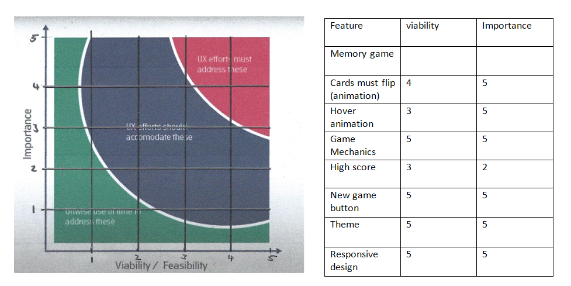
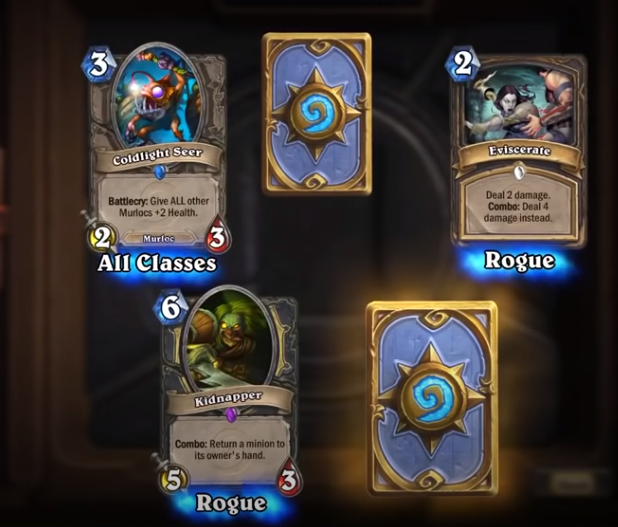
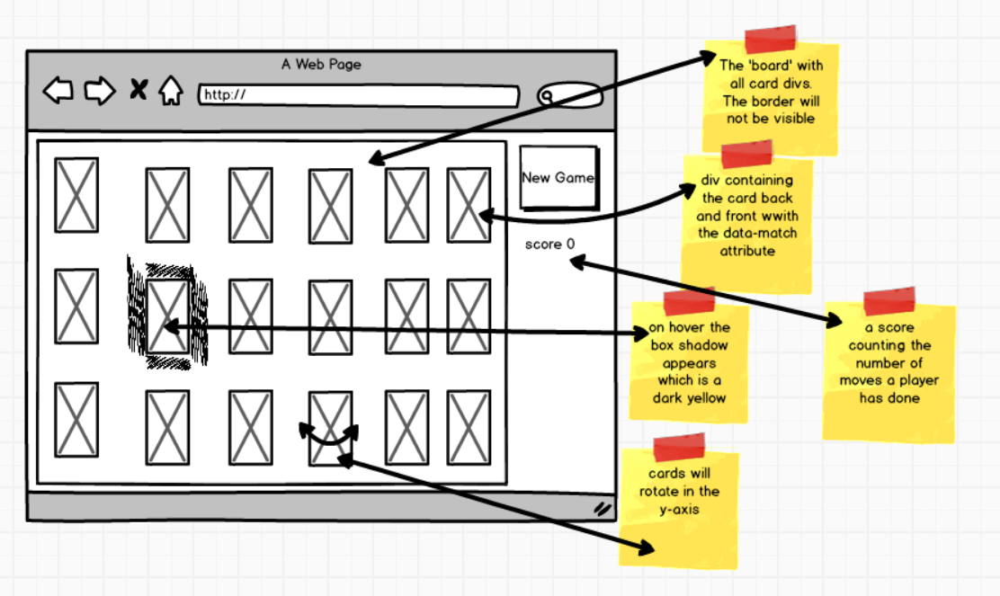
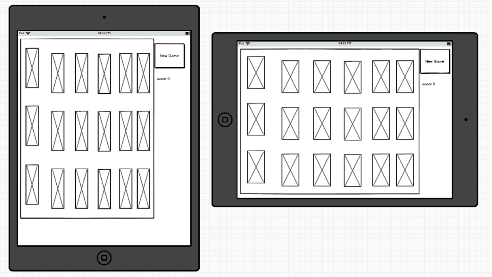
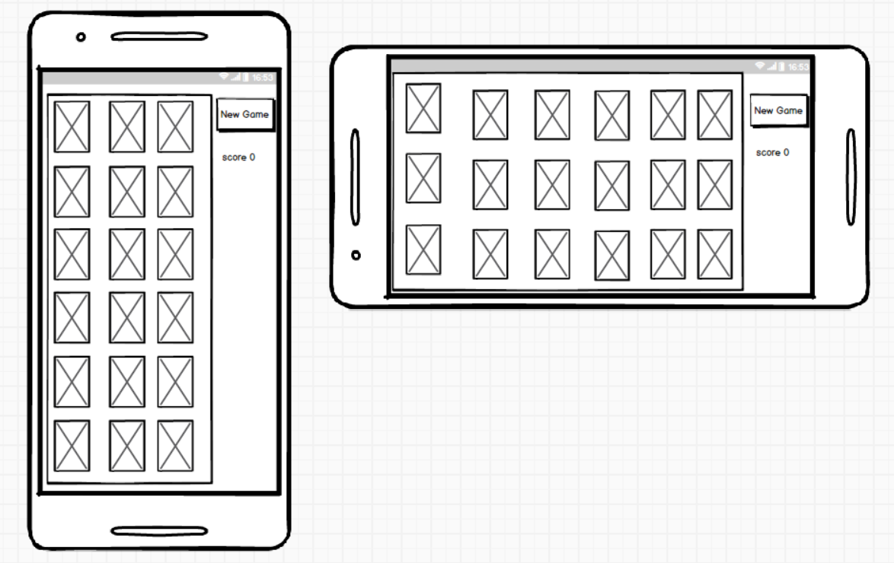

# Hearthstone Memory Game

Creating a custom memory game is something you would never think would be possible.
I have decided to take one of my favorite (and addicting) video games and turn it into a memory game.
This is "Hearthstone Memory". This is to be played in the exact same way as the original memory game, from Hasbros.

## Table of contents

<!--ts-->

- [UX](#UX)
  - [High level considerations](#High-level-considerations)
  - [Busniness goals](#Business-goals)
  - [B2B vs B2C](#B2B-vs-B2C)
  - [Strategy Trade-offs](#Strategy-Trade-offs)
  - [Scope plane trade offs](#Scope-plane-trade-offs)
  - [Scope plane requirements](#Scop-plane-requirements)
  - [Scope Plane Requirement types](#Scope-Plane-Requirement-types)
  - [The structure Plane concerns](#The-structure-Plane-concerns)
  - [Interaction design](#Interaction-design)
  - [Information architecture](#Information-architecture)
  - [Architecture types](#Architecture-types)
  - [principles of organisation](#Principles-of-organisation)
  - [The Skeleton plane](#The-Skeleton-plane)
  - [Habits & conventions](#Habits-&-conventions)
  - [Features and usefulness](#Features-and-usefulness)
  - [The Surface Plane](#The-surface-plane)
- [Features](#Features)
- [Technologies Used](#Technologies-Used)
- [Testing](#Testing)
- [Deployment](#Deployment)
- [Credits](#Credits)
<!--te-->

---

## UX

### High level considerations [back to top](#Hearthstone-Memory-Game)

Content on the site is culturally appropriate. The site only contains a game and a refresh button with a score, there is no malicious content. The target audience is mostly for children and teenagers looking to develop their attention and concentration. The theme of the game is based off “Hearthstone”, a strategy game owned by Blizzard. This means that the game and its theme are directed at cognitive development. “Hearthstone” does contain the same amount of violence as chess. This memory game contains no violence what so ever to make sure the site does not trigger the debate “do video games make children more violent”.

As this game is relative to children it can be accessed by anyone looking to develop their brain’s functions. It can also be accessed in schools that have the appropriate technology available for children. The Theme of the game is based off a strategy game, thus all the contents of the site are directed at cognitive development.

We can track and catalogue the content in an intuitive way. There can be future features where levels are incorporated that have cards from different expansions from “Hearthstone”, to prevent users from getting bored of the content. This means that we will have to create more cards, therefore we cannot just have heroes (like in the current version), and we will have to incorporate spell cards, secrets, monsters and weapons. We will also try to incorporate the High score system, which was traded off due to a lack of viability (see testing for more information).

The current medium for a memory game is a physical version which, according to “Amazon”, would cost a user £5-£20. “Hearthstone memory” however would cost the user less and still develop their brains in the same way. “Hearthstone memory” is going to be submitted as an educational piece of work to Code Institute and as such, will not be monetized; this will mean it will not trigger any copy right violations.

I used the most modern versions of HTML (HTML5), CSS (CSS3) and JavaScript to develop this game. I ran the code through “AutoPrefixer” to make it more “available” for any browser a user chooses to use to access the site.

### Business goals [back to top](#Hearthstone-Memory-Game)

This project is unique in the sense of its theme. The memory game itself is not unique as there are hundreds of different versions available. What differentiate other versions of the game are their themes. This would mean that this “Hearthstone memory” is unique in its own way, disregarding the fact that it is online, which is another unique feature.

Due to the fact that this project was inspired by Code Institute, it means that thousands of students have probably submitted a memory game as their milestone project since the Institute was established. Therefore we know there are many people who have submitted a similar project. We do not have access to any of their code thus we cannot tell how well they did. I am also submitting a memory game as my milestone project, thus I know that this project has the same viability as most other projects submitted. Unfortunately that means it will not be monetized.

The only issue that arises is that its theme is based off “Hearthstone” which is already owned by Blizzard. We can curb this issue as there are many knock off apps on any app store related to other games. For example, there was a “Call of Duty Black Ops 2” class editor available on the app store in 2013 when Call of Duty Black Ops 2 was booming on PlayStation and Xbox and there have been no repercussions.
The major tech considerations we need to establish is that the user needs a mobile device or PC that they can use with internet access, to play this game. No special skills are needed.
The Users we are aiming at are children and teenagers. The purpose of this product is to provide educational and entertaining content. The product has no key position in society like a heart rate monitor or a computer. “Hearthstone memory” is an alternative to the traditional memory game.

There are no stakeholders in the project. I am the only person working on it and I am not monetising it. I do not see future stakeholders participating in this project as it is on the edge of a copyright claim but it is for my milestone project at Code Institute, thus it is used for educational purposes only.

The only other people I know that are doing something similar is Code Institute students. I do not have access to their code and projects, thus I have no idea what they are doing or how they did it. I am following my own intuition and doing what I think is best. Other memory games that are online, like [helpfulgames.com](https://www.helpfulgames.com/subjects/brain-training/memory.html) have been coded in a similar way as my project. Inspiration has been drawn from this project.

This is a very minimalistic website, thus there is not a lot of features to add. As the project was being developed, users were interviewed looking for bugs in the code. See the “testing” section for more details.

Doing an existing product audit, I can see there are some improvements to be made. I would like the “new game” button to not just refresh the page, but to actually flip the cards over, shuffle them and allow users to click on them again. The issue arises with some bugs; there was a bug where users were able to double click on one card and the code would determine that there was a match. To hinder this, a “board lock” feature has been incorporated (see comments on assets/js/script.js) but this means that cards were not able to be clicked (“flipped over”) on the second round even after variables and cards were cleared for a new game. The second improvement I would like to make is to incorporate a high score. This would have been possible but first the “new game” button had to be fixed first so that the score can be pushed into an array, the array be sorted in an ascending order, and then the top 10 scores would be shown. If the score was lower than 8, it would not be counted as this would mean that a game was incomplete as there are 9 pairs of cards. This has been discussed with my mentor but due to a lack of viability this was not incorporated. Apart from those 2 failed features, I believe the coding for the bug fixes, the animation, the display of images and the game mechanics was well executed and I am proud with what I have done. I am aware that it is not the best memory game out on the market but it was my best effort.

### B2B vs B2C [back to top](#Hearthstone-Memory-Game)

As this is an educational piece of work with no form of monetization to prevent a copyright violation, this section will be minimal as monetizing this, is unethical and unlawful. There will be no online purchases; the emotional transactions will be simple and basic, with no branding, minimal content with large images. If anything is to be said about this product in this section, it should be considered as a B2C product.

### Strategy Trade-offs [back to top](#Hearthstone-Memory-Game)

Looking at what values I provide to set me apart from competitors is that I need to start by looking at the target audience. My target audience is children and teenagers. They are in the stages of brain development, thus minimal distractions need to be present. They also need to be accommodated on any device they are using. They might be advised by a guardian (teacher/parent) to play the game or do it out of free will. The final product needs to have a “gaming” feel to it, to distract them from the core purpose of the site; like taking medicine, if it tastes good then you will be more compelled to take it rather than hating it.

The users are expecting to play a game when the site is loaded. The user doesn’t need a lot of intuition to notice this. There needs to be an immediate display of cards and a new game button to show a user this, which there is. There is no input field for information thus it can be seen as a trusted site, that won’t farm data. There is no place for users to give feedback/contact me which is valued since having such fields will just create problems such as: the users might request something that they do not necessarily need.

Now I will have to look at the trade-off. Our total importance is 32, our average viability is 4.29 (2 dp). Multiplying our average viability by the number of items, we get 30. Our importance is greater than our viability, thus not all features can be implemented. We will have to scrap a few/one feature. In this case, I believe it should be the high score as mentioned above, in the existing product audit.

### Scope plane trade offs [back to top](#Hearthstone-Memory-Game)

Looking at what offers are open for discussion; it looks like we need to get rid of a feature to make the project more feasible. This has already been spoken about and some reasoning has been given but here I would like to discuss why other features have not been removed.

The first feature is that “Cards must flip (animation)”. This is essential as it provides a visual stimulus to the user. This is to pull their attention and make the game seem more “realistic”, even though it is a virtual game. If you flipped over a card in real life you would not expect it to instantly flash its other side immediately. This feature also supports the “game mechanics” feature which is essential as it is rated 5/5 on both importance and viability.

Next looking at the hover animation, this is seen as an essential. This is a feature pulled from hearthstone, making it a key part of the theme. In hearthstone, when a user wants to expand their card collection, they need to open “packs”, these contain 5 cards. Common cards are silver, rare cards are blue, epic cards are purple and legendary cards are gold/yellow. Having a hover function that gives a box shadow that is the “same” shade as a legendary is to emphasise more on the hearthstone theme of this memory game. See image bellow.

Being able to perfectly execute the game mechanics is a must. This feature is the most important part of the project. This is the core of the project, if this fails then the project fails, thus this cannot be replaced.

Players (users) would want this project to run as fluidly as possible, thus responsive design (image sizes and display) are just as important as the game mechanics. The user doesn’t want to (knowingly) refresh the page, but if our new game button does it for the user without them knowing then it adds to a positive user experience because a new game will start and the cards will be shuffled.

### Scope plane requirements [back to top](#Hearthstone-Memory-Game)

Looking at my scope plane requirements, I will have to examine the requirements and functional specification regarding; “what users say they need” and “what users actually need”.

Firstly looking at what users say they need, this is what the requirements for the project are. The users will need a memory game that is fully functional and needs to be unique. I completely agree. What Users say they need is the same as what they actually need, in this case, but due to constraints in the project the high score feature will have to be removed. There is only 1 way to play the memory game and where you start, doesn’t matter, the end will still be the same.

### Scope Plane Requirement types [back to top](#Hearthstone-Memory-Game)

Examining the content requirements elaborates more on the theme of the memory game. There will not be a lot of mixed media on this page. We will just have a number of pairs of images from hearthstone heroes. Their non-functional requirements are negligible. I do have the viability to produce the desired content; all I need to do is research the media and get the media into my repository to be able to use it. The content requirements mainly focus on the game mechanics in such a way that the final product is viable.

Looking at the requirement types of this project we have to see if this project is; useful, sellable, buildable, objective, functional and what is non-functional. This project is useful for me as it contributes to my MS2 grade and to users looking to develop their cognitive ability. This project is not sellable as it contains media from my already owned game that is played by millions and can result in a copyright infringement. This project is buildable in the sense that it can meet the client’s requirements but it will not look the exact same since features have to be removed. The users want a completed game that works to develop their cognitive ability, and that has been provided. The loss of one feature does not impact the project in a large degree and the lost feature can be considered negligible in the first place. The game is fully functional, the game mechanics work, cards do not match with themselves and trying to break the game is not possible. The only non-functional aspect of the game is the scalability. We will need a better hosting platform to be able to handle a larger traffic.

### The structure Plane concerns [back to top](#Hearthstone-Memory-Game)

The organisation of the content will be simple. There will be a “board” that will contain the “cards”. As the screen sizes vary, the board will take the same percentage of space but the cards will resize to fill the board as much as possible. The exact layout of the cards will not be the same on all devices due to their varying screen sizes and my attempt to make all the cards fit on the board without the user having to scroll. What is the point in playing a game that requires a user to scroll? There is no point, it ruins the user experience.

There is no navigation on the game page; this is to prevent games from being interrupted and for users to navigate off the page. There is no information present, all the user has to do is click on cards and look for their matching pair with the lowest score possible. The game is self-explanatory.

The site will just have a linear narrative where everything is just on one page. It is logical and straightforward for a game.

### Interaction design [back to top](#Hearthstone-Memory-Game)

The layout of the page will be ± 80% “board” where cards will be displayed in, then the remaining 20% will be for the “new game” button and the score. When a user hovers over a card a box shadow will appear in the same shade as a legendary card in hearthstone. When a user clicks on a card, the card should flip around displaying a hero of hearthstone. The user then has to click on another card to see if the second card matches the first card. The cards will be on display for a few seconds before they flip around, if they do not match. If the cards do match, then the cards will be displayed constantly until a new game is started. The cards will not be able to be flipped over if they already match with another card. The game ends when all matching pairs have been found, or the user gives up and clicks “new game”.

To create meaningful relationships between the elements and content I aimed for consistency. I have the same text colour for the text, the card backs have the same style from an expansion from hearthstone and the front of the cards are the original 9 heroes a hearthstone player can get. Also while hovering over the cards; the box shadow will have the same shade. The same scenario will happen constantly; when a user clicks on a card its rotation is the same as for all the cards. Users who have played any memory game before can leverage from prior experience.This is to ensure that the expectation of convention is met.

Making sure that the game mechanics work and that all cards behave the same when clicked ensures that the functionality and interactivity is communicated to the user intuitively. All elements on the page are discoverable. There is a little content hinting (the box shadow) to pull the user into clicking the cards so that the animation can be shown and that the game can flow.

Once a user starts interacting with the cards by clicking on them then the orchestrated pattern of the game becomes visible. The game is very self-explanatory. If a user doesn’t grasp the concept immediately the new game button is there to start a new fresh game for the user to try and play again. The positioning of the board and the buttons will be in the same positions all the time; users do not have to worry about the game changing at any time.

All of the code to make this game is to ensure that the game produces zero user error; no matches with double click, no speed running and no false matches can happen. No matter on what device you are on, the game will still work the same way and it will work on whatever orientation the device is in. The cards will change size if the orientation is changed and the layout of the cards will be different if a different device is used. The same game cannot be played twice due to the random number generation.

The theme of hearthstone memory is to be different to make the game better. Classical images (like a red balloon) have been replaces with hearthstone heroes. This is to surprise the user in a positive manner so that their expectations are not met in a positive way.

There is no other content on the page to ensure that users are not distracted from the primary purpose of the game – to be played and to develop their brains. The game itself is sticking to traditional memory game conventions and is very intuitive. This is ensuring the website is learnable.

### Information architecture [back to top](#Hearthstone-Memory-Game)

There are currently no forms of navigation to the site. Its raw form is a game. Until further levels have been incorporated there will be no navigation. When more levels have been incorporated then the use of a drop down box with the different levels can be incorporated. Each item in the drop down lost will be a hyperlink to a new website with a different game.

To facilitate the future changes the drop down box will most likely come under the score of the player.

### Architecture types [back to top](#Hearthstone-Memory-Game)

Due to the simplicity of this site, there is little to no consideration for the architecture type of the site as it consists of only one page. In future updates (scoreboard working, high score feature incorporated, levels etc.. ) the most likely architecture type we can expect is the tree structure, which is standard; to reduce complexity and to make use of the “three click” rule of thumb. The only issue is that it will be complicated on mobile but to compensate for that the drop down menu list with link to other sites simplifies the problem

### Principles of organisation [back to top](#Hearthstone-Memory-Game)

The principles of organisation I used follow the organising rules of thumb. The highest level of the site is most closely tied to the user needs – the memory game. There are no organising rules at lower levels because future specs have not been incorporated and the content requirements are minimal. The collection of cards are placed in a board for conceptual structure, and the same applies to the score and the new game button – they have been placed in a separate div. We know that the cards are displayed together in rows and columns – traditionally and I tried to replicate that in my game. The “new game” button and score are not mixed in with the cards to satisfy user needs and for easy of convention.

### The skeleton plane [back to top](#Hearthstone-Memory-Game)

The form the application will have to take will have to be a single site that fills the entire screen – no matter the orientation of the device. All cards need to be visible at all times including the new game button and the score. No navigation is necessary. The content will be presented in the form of images, buttons and text. The images will be the cards that should be larger than the “new game” button and the text to draw attention to the game. The cards should be in rows and columns that do not overlap so that each card can be clicked, seen and can be read.

### Habits & conventions [back to top](#Hearthstone-Memory-Game)

Looking at the habits & conventions of users that play memory is that they place the cards face down, then they shuffle their cards, then organise their cards in rows and columns, then play the game. I programmed my code to do the same. Before the page is loaded the face down cards are shuffled and then the cards are sorted into their rows and columns. This is to match the expectations of the project – creating a playable memory game. Breaking the code to break from convention was a bad idea – regarding the attempt to program the new game button (merge 8?). It was an attempt to better the product but it did not work.

The use of visual iconography especially on the new game button and the cards helps users to understand what is going on, on the site. It allows the user’s to comprehend what is going on. They are then inclined to play the game.

### Features and usefulness [back to top](#Hearthstone-Memory-Game)

Hearthstone memory gives the users a memory game. They can access it anywhere and at any time. Using only a visual format attempts to provide the users with a need to want to access/interact with the game. This directs the user to believe that the UI is the system. With the current layout and design the UI allows immediate interaction and promotes first tie learning. The mild theme makes it audience appropriate. I believe the current product perfectly meets the needs of its intended audience.

### The surface plane [back to top](#Hearthstone-Memory-Game)

These images describe how the general layout will be for desktop and mobile devices.

## Features [back to top](#Hearthstone-Memory-Game)

There are multiple features inside this product. Firstly the cards must be able to flip. This has been done using CSS, especially using the transform property and and the perspective property.
The hover animation was done using the CSS box shadow and the :hover psuedo class.
The game Mechanics were written in JavaScript. A more detailed explination on the javascript can be found in assets/js/script.js.
The "new game" button acts as a page refresh button to restart the game, as spoken about in the UX; the code to prevent bugs causes this.
The Theme of the game was inspired by "hearthstone" owned by Blizzard.
The responsive design allows for different types of devices and users to be able to use the product.

### Existing Features

- The flip animation - Is designed to draw user's attention and look realistic
- The hover animation - Is designed to resemeble Hearthstone "pack opening" which is a core part of it's theme
- The Game mechanics - This is to allow the game game to be as full functional as possible.
- The New Game button - This allows the user to start a new game of they completed the game or have given up and want to try again.
- The Media - This coincides with the theme of the memory game - Hearthstone
- The Responsive design - This allows different devices to experience the same product with minimal variations.

### Features Left to Implement

- A proper New Game button that works without having to refresh the page
- A High Score system so users can attempt to break their personal best

## Technologies Used [back to top](#Hearthstone-Memory-Game)

In this section, I mention all of the languages, frameworks, libraries, and any other tools that I have used to construct this project.

### Lanuages

- [HTML](https://en.wikipedia.org/wiki/HTML5)
- [CSS](https://en.wikipedia.org/wiki/Cascading_Style_Sheets#CSS_3)
- [JavaScript](https://en.wikipedia.org/wiki/JavaScript)

### Tools

- [Autoprefixer](https://autoprefixer.github.io/)
- [Markup Validation service](https://validator.w3.org/)
- [GitHub](https://github.com/)
- [Git](https://git-scm.com/)
- [Gitpod](https://chrome.google.com/webstore/detail/gitpod-online-ide/dodmmooeoklaejobgleioelladacbeki?hl=en)
- [VSC](https://code.visualstudio.com/download)
- [Microsoft Office](https://www.office.com/)
- [favicon](https://www.favicon.cc/)
- [JSHint](https://jshint.com/)

### Frameworks

- [Bootstrap](https://getbootstrap.com/)
- [Popper](https://popper.js.org/) - this as used with the bootstrap JS CDN

### libraries

- [JQuery](https://jquery.com)

## Testing [back to top](#Hearthstone-Memory-Game)

During various branches, which have been merged to the final
materbranch, I have tested the game on twin teenagers (16).
They have supplied feedback which has been taken care of as some of their input was implemented. These have
been documented in this section.

Initially we tried to implement testing via [jasmine](https://jasmine.github.io/) but that was not possible since I had to parce
values into a function to test it,which was not possible for the code I had written. This means that I had to
resort to physical testing.

- Test 1: Animating the cards to flip

  - Some time was spent on [researching the 3d persepctive css property](https://3dtransforms.desandro.com/perspective).
  - Then some time was spent on [how to flip cards using css](https://www.w3schools.com/howto/howto_css_flip_card.asp).
  - mutiple attempts was made to flip cards on click (via a css class "flip"), and then the successful version was commited.
  - Cards now successfully flip with no bugs.

- Test 2: Matching the cards

  - We needed to make sure the cards match and to do this I researched the [data match attribute](https://www.w3schools.com/tags/att_data-.asp).
  - we then used the "data-match" attribute with a assigned value that will be compared in script.js.
  - the "data-match"values will be compared and if they match the cards will not be able to flip back; for this we turned off their click fucntions.
  - If the "data-match" values do not match, the cards will be unflipped by removing the "flip class"
  - Some bugs were discovered at this Stage

- Test 3: Bug 1; Speed runs

  - If a user was to quickly click through the matches, more than 2 cards would be revealed
  - I created a setTimeout() function and a lock variable.
  - The setTimout functions displays the faces of the cards for a certain period of time before the cards are unflipped (the "flip" class was removed)
  - In the mean time while the card's faces were shown the board would be locked (lock variable).
  - Bug was successfully removed, a user can no longer click through the cards at random speeds.

- Test 4: Bug 2; Single card matching with itself

  - When double clicking on a card a match would happen
  - To prevent this the cardFlipped variable and the lock variable were created.
  - If the card was already flipped the function which would run the match check would not be activated
  - Bug was successfully removed, no double click matches would happen

- Test 5: Cards shuffle every new game

  - I created a self invoking function that assignes a random number between 1-18 to each card
  - Then the cards are sorted in the order the random number is assigned to them.
  - This happens each time the page loads
  - Each time the page is loaded this function happens successfully.

- Test 6: Creating a new game
  - Due to the code invoked for the bugs, starting a new game without refreshing the page is a strenuous task
  - This resulted in the "new game" button becoming a page refresh button
  - This also prevented the "high score" feature to be implemented
  - page now refreshes and the game is reset properly but the highscore feature has to be removed.

During development, the card distribution was not the same as the surface plane from the UX section. this is due to the sizes of the cards and their shape. only on some devices will there be an extra row with 2 cards or instead of three rows, there are 2 rows. This does not change the game at all but the display is not the exact same as the wireframes. This is slightly dissapointing but the main goal of not having the cards run over the "board" section is still achieved and that is the most important part.

## Deployment [back to top](#Hearthstone-Memory-Game)

To be able to deploy this project, I used GitHub Pages. To do so:

- start at the repository in github (https://github.com/KeisGSmit/Milestone2)
- click on the settings Tab
- Scroll down to the section titled "GitHub Pages"
- I selected the master branch in the drop down list and then click save
- The project will then be prepared and then will be live in about 5 minutes.

There have been some differences in the developed version and the deployed version. In the development version, each time a feature would be worked on, a seperate branch would be created and then the feature would be implemented to that seperate branch. When all the desired features for the branch have been added then a pull request would occur and the branch will be pulled to the master branch. From there another branch would be created. This proccess repeated until the final produuct is on the master branch.

To be able to run the code locally on your own PC, do as follows;

- Start at the repository in github (https://github.com/KeisGSmit/Milestone2)
- click on the green "code button", select "download zip"
- select a place where this zip file will be saved on your device and unzip it
- you can click and drag this unzipped file into a IDE application like VSC (see tachnologies used) to be able to edit the repository
- You can open the unzipped file and double click on index.html to launch the product.

## Credits [back to top](#Hearthstone-Memory-Game)

### Content

- The idea for the game mechanics was inspired by [helpfulgames.com](https://www.helpfulgames.com/subjects/brain-training/memory.html)
- The score was inspired by [stackoverfloww](https://stackoverflow.com/questions/22402777/html-javascript-button-click-counter)
- The attempt to make a new game was inspired by [stackoverfloww](https://stackoverflow.com/questions/30204473/adding-a-reset-new-game-button-to-code)
- Inspiration for the game mechanics came form [scotch.io](https://scotch.io/tutorials/how-to-build-a-memory-matching-game-in-javascript)

### Media

- The card back was optained from [engadget](https://www.engadget.com/2014-02-26-new-hearthstone-card-backs-revealed.html)
- The card front for Jaina Proudmoore was optained from [HearthstoneWiki](https://hearthstone.gamepedia.com/Jaina_Proudmoore)
- The card front for Rexxar was optained from [HearthstoneWiki](https://hearthstone.gamepedia.com/Rexxar)
- The card front for Malfurion Stormrage was optained from [HearthstoneWiki](https://hearthstone.gamepedia.com/Malfurion_Stormrage)
- The card front for Uther Lightbringer was optained from [HearthstoneWiki](https://hearthstone.gamepedia.com/Uther_Lightbringer)
- The card front for Anduin Wrynn was optained from [HearthstoneWiki](https://hearthstone.gamepedia.com/Anduin_Wrynn)
- The card front for Valeera Sanguinar was optained from [HearthstoneWiki](https://hearthstone.gamepedia.com/Valeera_Sanguinar)
- The card front for Thrall was optained from [HearthstoneWiki](https://hearthstone.gamepedia.com/Thrall)
- The card front for Gul'dan was optained from [HearthstoneWiki](https://hearthstone.gamepedia.com/Gul%27dan)
- The card front for Garrosh Hellscream was optained from [HearthstoneWiki](https://hearthstone.gamepedia.com/Garrosh_Hellscream)

### Acknowledgements

- I received inspiration for this project from Code Institute who recommended a memory game for my MS2.
- My game was tested by my 2 sisters who are 16 to help look for bugs
